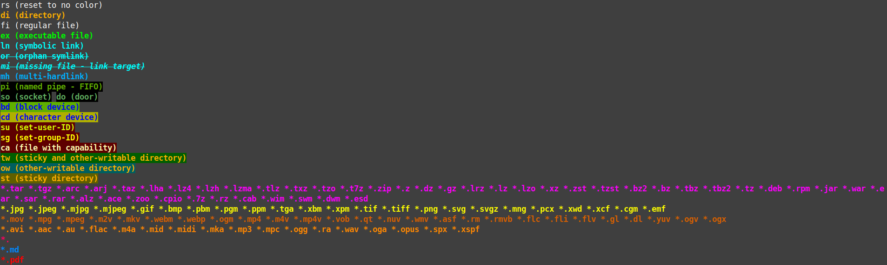

# My personal ZSH config

## Install:
```
./install.sh
```

## My $LS_COLORS


## Useful scripts can be found in scripts/:
    - colortest.sh - display 256b colors to help you customise LS_COLORS
    - ls_colortest.sh - display currrent LS_COLORS bindings
